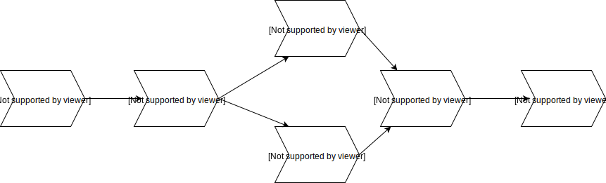
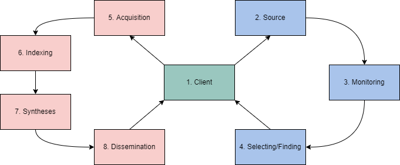

# Day 16 - OSINT

* OSINT stands for Open Source Intelligence
* Common sources
	* Social networks
	* OpenSource platforms
	* Deep search using Search Engines queries (like Google or Yandex)
	* Other types of searches (images, maps, etc)
* Darknet sources
    * TOR
    * Freenet
    * I2P
    * IPFS
    * Zeronet

## Process Cycle
There is many metodologies.

In this case we are focusing on RIS OSINT information models from [this research paper](https://arnoreuser.com/wp-content/uploads/2018/12/201712-The-RIS-OSINT-Intelligence-Cycle.pdf).

### The approach

The RIS OSINT Roller Coaster outlines phases of an OSINT investigation centering around the client. This is an ever-evolving process that will change and continue depending on intelligence and decisions from the previous model.

RSI Phase | Definition	Example | Example
--- | --- | ---
Client | What is the question/objective? | Email
Source | What is available on the objective? | Email servers, etc.
Monitoring | What is happening with the objective? | Email has been inactive
Selecting/Finding | Where is the objective? How can we find/identify the objective? | Clearnet, Gmail, etc.
Acquisition | How can we get the objective? | Leaked database
Indexing | How is the objective retrievable? | Dehashed
Syntheses | How can we combine this objective with others? | Identify information from email
Dissemination | How can you action/quantify this objective? | Report/Plan

## Account Discovery & Analysis
Objective | Purpose
---|---
Identify real or personas | A target will often use a persona. Depending on initial information, we are looking for their real name or persona to find other accounts. Our end objective is to identify further information and accounts owned by our target.
Identify email | This is less common to find openly but can help identify further information of the target and other sources.
Locate linked accounts | Targets will often link other public accounts leading you to further information or their real name/persona.
History | The importance of a target's post history will depend on your objective. This could be crucial to your investigation and lead you to what they're doing or pivot to another resource.
Information from posts | Continuing from a target's post history, you can obtain various information from a target's posts. This can include location, other accounts, real name, interests, etc.

## Google Dorking
| Term | Purpose | Example |
--- | --- | ---
site  | Specifically searches that particular site and lists all the results for that site. | site:"www.google.com"
filetype | Searches for a particular filetype mentioned in the query. | filetype:"pdf"
link | Searches for external links to pages. | link:"keyword"
  inurl | Searches for a URL matching one of the keywords. | inurl:"keyword"
before/after | Used to search within a particular date range. | (before:2000-01-01 after:2001-01-01)

## OSINT & The Blockchain
We can identify blockchain identifiers using multiple tools including but not limited to:

* Blocktrail
* Bitcoin Who's Who
* Graphsense
* Block Explorer

Although identifiers may be anonymous, that does not make them less unique or impossible to link to personas. When faced with blockchain technology, our end goal is to get back to a traditional persona.

# Going Deeper
At its core, OSINT is searching and identifying information. However, we also need to look at how we can use platform functionality to our advantage to get further information and links that may still be publicly accessible but are not easily found.

 It is essential to familiarize yourself with all of these platforms and understand their ins and outs.

An example of an unintentional information leak from GitHub could be a company that forgot to delete its API keys from a JSON file. They made a new commit to their repository with the thought that no one could access those keys anymore. Anyone can look at a public repository commit history and view exactly what was deleted and added to the repository.
